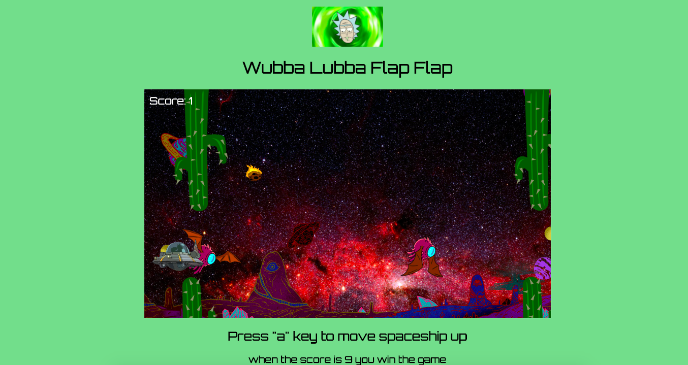

# WubbaLubbaFlapFlap

### Play the game live [here](https://wubbalubbaflapflap.netlify.app/)

#### This game inspired by the arcade game Flappy Bird, built by Vietnamese video game artist and programmer Dong Nguyen. 
#### In the game the player controls a bird, attempting to fly between columns of green pipes without hitting them. 
#### This game has the same premise with an addition of another level, which will increase in difficulty and when both levels are cleared, 
#### the player wins the game.

## Game description
Since this game is “Rick and Morty” themed, elements are changed to suit it. In this game, the bird is the spaceship and the 
player could be able to control it. The player must dodge obstacles present, which are the cacti in both levels, much like the green pipes 
in Flappy Bird. In order to win the player must reach the end of world two. There will be a portal at the end of level 1, which will 
‘transport’ the player into world two. This world is identical to world one except the difficulty will be increased as the player must also dodge 
objects fall from the top of the canvas, which is the asteroid in this case. When this level, level 2, is cleared the player wins the game.

## Sketch

